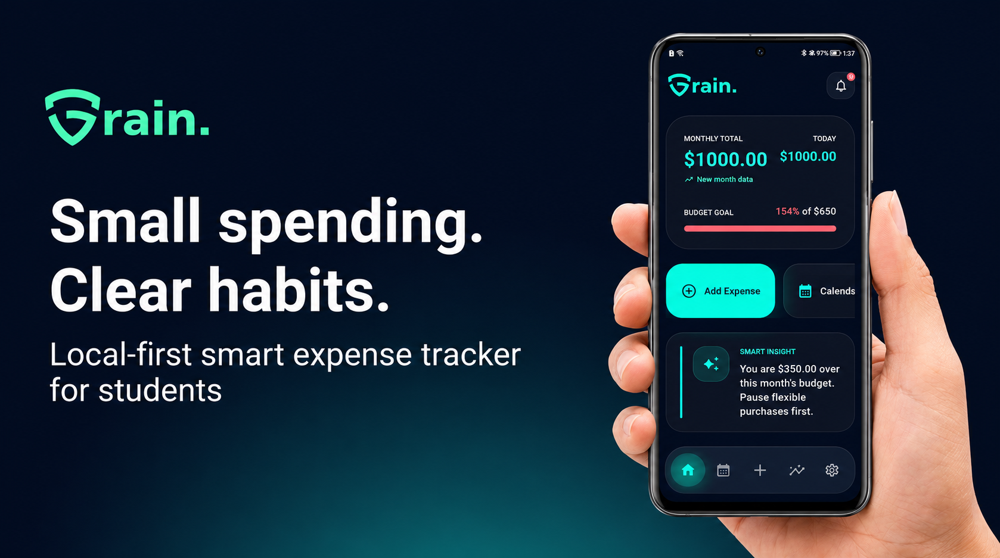
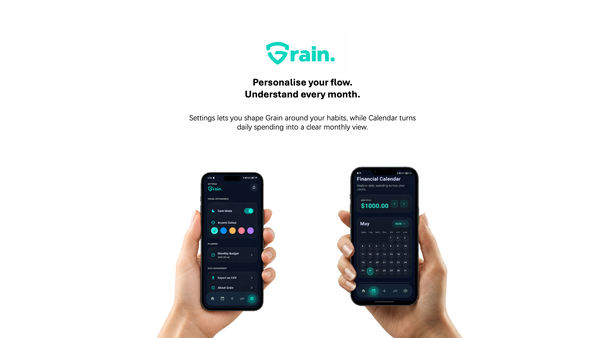
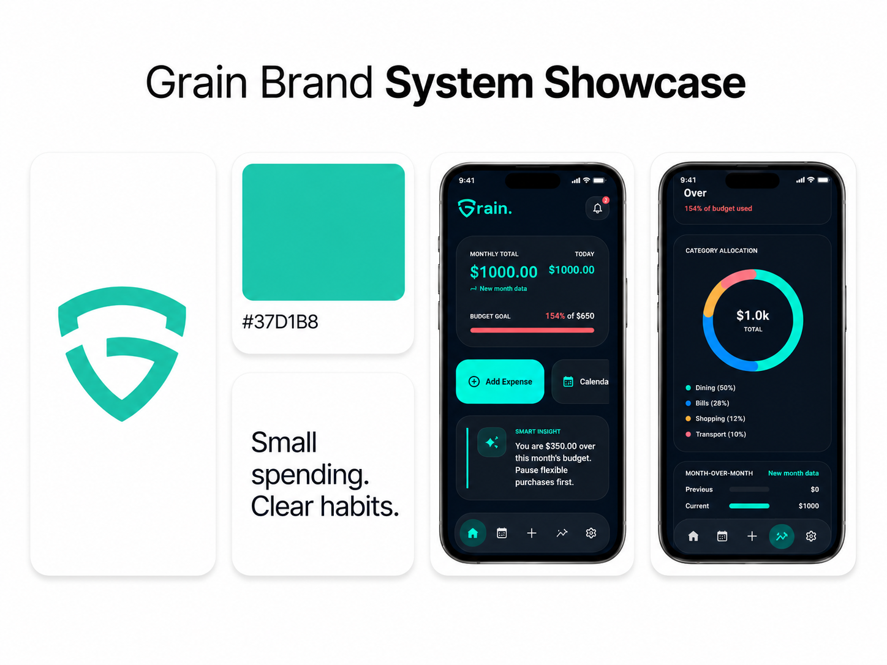
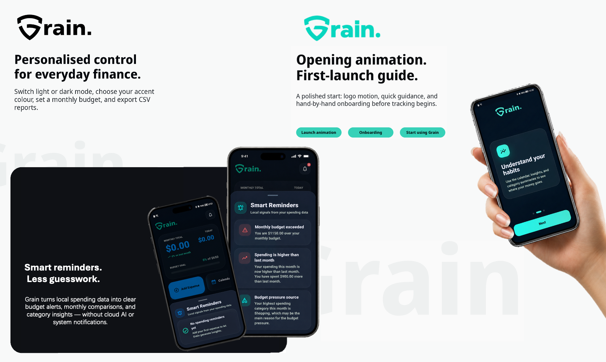

# Grain App

**A local-first smart expense tracker for students.**

Grain is a Flutter/Dart personal expense tracker developed as part of the INFO1111 Advanced Self-Learning Assignment. It helps users record daily expenses, understand spending habits, and receive local smart reminders without cloud AI or system notifications.

> Small spending. Clear habits.

## Product Highlights

- Add and manage expense records
- Calendar-based spending view
- Local smart reminders
- Monthly budget tracking
- Theme personalisation
- CSV export

## Personalised Control and Monthly View

Grain supports theme customisation, monthly budget setting, CSV export, and calendar-based spending review.

## Brand and UI System

The visual identity uses Grain's teal-green accent colour, dark fintech UI cards, and a local-first smart finance product style.

## Technology

- Flutter / Dart
- SharedPreferences local persistence
- Codemagic Android APK build
- GitHub version control
- Stitch UI references
- Codex / GPT-5.5 Thinking assisted implementation

## Development Focus

This project explores how generative AI tools can support software product development, including product planning, UI redesign, debugging, testing, smart feature design, and product polishing.

## Build Target

This project is demonstrated as an Android APK. Although the Flutter project contains iOS and other platform folders, Android was selected as the main demonstration target because APK builds are easier to generate, install, and test without Apple signing or TestFlight distribution.
